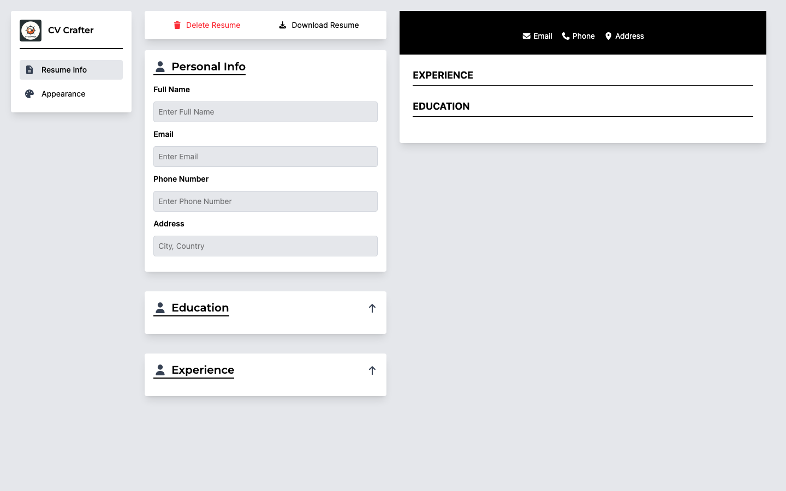

# CV Crafter

An interactive CV builder created with React and Tailwind CSS. CV Crafter lets users enter personal, education, and experience details, see changes in a live resume preview, customize the document's appearance, and print or save the finished result through the browser.

[View the live app](https://mohamedmosilhy.github.io/CV-Application/) · [View the source](https://github.com/mohamedmosilhy/CV-Application)



## Features

- Live resume preview beside the editor
- Personal details for name, email, phone number, and location
- Multiple education records
- Multiple professional experience records with descriptions and dates
- Add, edit, and delete workflows for repeatable sections
- Three resume layouts: top, left, and right
- Custom header/accent color picker
- Automatic contrasting text color for light and dark selections
- Reset control for clearing resume content
- Print-ready output using the browser print dialog
- Responsive editor and preview layout

## Application design

`App.jsx` owns resume data and appearance state, while focused components handle the interface:

- `Controllers` switches between resume content and appearance tools.
- `Content` renders the relevant forms and customization controls.
- `Card` provides reusable expandable forms and record editing.
- `Template` formats the current data into the selected resume layout.

`react-to-print` connects the preview element to the browser's print workflow. Users can select “Save as PDF” in browsers that provide that destination.

Resume data is held in React state and is not persisted after a page refresh.

## Built with

- React 19
- Vite 7
- Tailwind CSS 4
- react-to-print
- Font Awesome React components
- ESLint

## Getting started

### Prerequisites

- Node.js
- npm

### Installation

```bash
git clone https://github.com/mohamedmosilhy/CV-Application.git
cd CV-Application
npm install
npm run dev
```

### Available scripts

| Command | Purpose |
| --- | --- |
| `npm run dev` | Start the Vite development server |
| `npm run build` | Build for a root-path deployment |
| `npm run build:gh` | Build with the `/CV-Application/` GitHub Pages base |
| `npm run preview` | Preview the generated build |
| `npm run deploy` | Build and publish to GitHub Pages |

## Project structure

```text
CV-Application/
├── src/
│   ├── assets/
│   ├── components/
│   │   ├── Card.jsx
│   │   ├── Content.jsx
│   │   ├── Controllers.jsx
│   │   └── Template.jsx
│   ├── App.jsx
│   ├── index.css
│   └── main.jsx
├── vite.config.js
└── package.json
```

## Deployment

The Vite configuration selects the GitHub Pages base path only in `gh` mode. Use `npm run deploy` for the hosted repository version; use the standard build for root-domain hosting.
